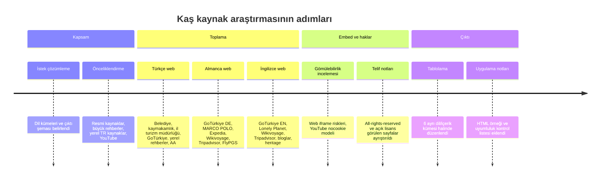

# Kaş için gömülebilir çok dilli kaynak envanteri

## Yönetici özeti

Bu çalışma, **29 Nisan 2026** itibarıyla Kaş hakkında site içine yerleştirme açısından en kullanışlı kaynakları; resmi/yarı resmi sayfalar, güvenilir seyahat rehberleri, haber içerikleri ve YouTube videoları olarak üç dilde derler. En güçlü **birincil Türkçe çekirdek set**, entity["organization","Kaş Belediyesi","municipality, kas, antalya, tr"], Kaş Kaymakamlığı, entity["organization","Antalya İl Kültür ve Turizm Müdürlüğü","antalya, antalya, tr"] ve entity["organization","GoTürkiye","turkish tourism promotion"] içeriklerinden oluşuyor; bunlar Kaş’ın belediye haberleri, turizm anlatıları, tarihsel mirası ve Kekova/tekne turu gibi temalarını doğrudan birincil dille sunuyor. citeturn21view0turn21view1turn21view2turn31view0turn31view1turn31view2

Almanca tarafta Kaş’a özgü kaynak sayısı Türkçe ve İngilizce kadar yoğun değil; pratikte en kullanılabilir set, Almanca yerelleştirilmiş GoTürkiye sayfaları ile büyük Alman seyahat yayıncılarının rehberlerinden oluşuyor. Bu grup içinde özellikle GoTürkiye’nin Almanca destinasyon sayfaları, entity["company","MARCO POLO","travel publisher"], entity["company","Expedia","travel company"], FlyPGS, Alman entity["organization","Wikivoyage","travel wiki"] ve Alman entity["company","Tripadvisor","travel platform"] sayfaları öne çıkıyor. citeturn28view2turn28view3turn28view4turn28view5turn24view0turn23view7turn28view0turn26view1

İngilizce tarafta resmi ve yarı resmi destinasyon anlatıları ile küresel seyahat rehberleri birlikte güçlü bir set veriyor: GoTürkiye’nin rota ve dalış içerikleri, entity["company","Lonely Planet","travel publisher"], English Wikivoyage, English Tripadvisor, blog rehberleri ve akademik/yarı akademik arka plan için Ancient Theatre Archive en faydalı kümeyi oluşturuyor. citeturn29view0turn29view1turn29view4turn7search2turn21view10turn29view3turn25view2turn29view6turn22view7

Gömülebilirlik bakımından ana sonuç nettir: **YouTube videoları**, `youtube-nocookie.com` üzerinden en öngörülebilir ve en düşük sürtünmeli embed seçeneğidir; buna karşılık tam web sayfası iframe’leri, çoğu yayıncıda `X-Frame-Options` veya CSP nedeniyle reddedilebilir. Bu yüzden KaşGuide için pratik mimari, web sayfalarında **önizleme kartı + dış bağlantı**, videolarda ise **privacy-enhanced YouTube embed** yaklaşımıdır. citeturn16search3turn16search15turn16search1turn16search0

Telif ve lisans tarafında açık biçimde yeniden kullanım dostu olan örnekler azdır. Erişilen materyaller içinde açık lisansı net görülen başlıca örnekler Wikivoyage’ın **CC BY-SA** modeli ve Ancient Theatre Archive makalesinin **CC BY-NC-SA** lisansıdır; buna karşılık GoTürkiye, Kültür ve Turizm Bakanlığı, Tripadvisor, Expedia, MARCO POLO ve Anadolu Ajansı gibi büyük kaynaklar erişilen sayfalarda açıkça “tüm hakları saklıdır” ya da eşdeğeri bir koruma mantığı gösteriyor. Bu nedenle, **tam sayfa veya medya kopyası yerine alıntılı özet + link + gerektiğinde izin** stratejisi hukuken daha emniyetli görünür. citeturn22view1turn22view2turn29view1turn22view6turn23view7turn24view0turn23view5turn22view5turn22view7

## Yöntem ve seçim ölçütleri

Seçim mantığı şu öncelik sırasına göre kuruldu: önce resmi ve birincil kaynaklar, sonra büyük uluslararası seyahat rehberleri, ardından yerel Türkçe rehberler ve haber kaynakları, en sonda da Kaş temalı YouTube videoları. Özellikle Kaş’ın tarih, dalış, Kekova, Kaputaş ve merkez/çarşı deneyimi gibi tekrar eden ana temalarını taşıyan sayfalar tercih edildi. citeturn21view1turn31view0turn31view1turn29view1turn29view4

Aşağıdaki **web tablolarında** `iframe:test` kısaltması şu öneriyi ifade eder: `src="URL" loading="lazy" referrerpolicy="strict-origin-when-cross-origin"`. Ancak bu yalnızca test amaçlıdır; gerçek yayında varsayılan olarak **kart + dış link** tercih edilmelidir, çünkü framing çoğu sitede sunucu başlıklarıyla engellenebilir. citeturn16search3turn16search15turn16search2turn16search6

**YouTube tablolarında** embed sütununda doğrudan `youtube-nocookie.com` bağlantısı verildi; bu, YouTube’un dokümante ettiği **Privacy Enhanced Mode** yaklaşımıdır. Gerekirse oynatıcı parametreleri ayrıca genişletilebilir. Ayrıca YouTube, iframe oynatıcısı için en az **200×200 px**, 16:9 için ise en az **480×270 px** öneriyor. citeturn16search1turn16search0turn16search16

Hedef CMS kullanıcı tarafından belirtilmediği için bu rapordaki embed önerileri **CMS-bağımsız HTML** mantığıyla yazıldı. Açıkça özgür lisans beyanı bulunmayan görseller/media dosyaları ayrıca listelenmedi; bu durumda “gömmek” ile “atıfla link vermek” bilinçli biçimde ayrıştırıldı. citeturn22view5turn22view7turn27search0

## Web kaynak tabloları

**Türkçe web sayfaları**

| Title | URL | Language | Type | Summary | Embed snippet | License/notes |
|---|---|---:|---|---|---|---|
| Kaş Belediyesi | https://www.kas.bel.tr/ | TR | official tourism site / municipal | Belediye ana sayfası; haberler, duyurular ve turizmle ilgili yerel gündemi tek yerde topluyor. Özellikle etkinlik ve yerel proje takibi için birincil kaynak. citeturn21view0 | `iframe:test; engellenirse card+link` | Açık lisans bilgisi erişilen snippet’te görünmedi; kurum içeriği için tam yeniden yayın yerine özet+link daha güvenli. |
| Kaş Kaymakamlığı - Turizm | https://kas.gov.tr/turizm | TR | official tourism site | İlçenin turistik anlatısını doğrudan veren resmi sayfa; özellikle Kaputaş gibi temel görülecek yerler için açıklayıcı bir özet sunuyor. citeturn21view1 | `iframe:test; engellenirse card+link` | Açık lisans bilgisi erişilen snippet’te görünmedi; resmi içerik olsa da alıntı ölçülü tutulmalı. |
| Kaş - Antalya İl Kültür ve Turizm Müdürlüğü | https://antalya.ktb.gov.tr/TR-68279/kas.html | TR | official tourism site | Bakanlık bağlı il müdürlüğünün Kaş sayfası; fotoğraf galerisi, tanıtım filmleri, müze/ören yeri ve GoTürkiye bağlantılarını bir araya getiriyor. citeturn21view2 | `iframe:test; engellenirse card+link` | Footer’da “Tüm hakları saklıdır © 2026 | T.C. Kültür ve Turizm Bakanlığı” ifadesi yer alıyor. citeturn22view1 |
| Antiphellos (Kaş) - Antalya İl Kültür ve Turizm Müdürlüğü | https://antalya.ktb.gov.tr/TR-312262/antiphellos-kas.html | TR | official tourism site / heritage | Kaş’ın antik geçmişi için en kullanışlı resmi heritage sayfalarından biri; Antiphellos’un Phellos limanı olarak gelişimini özetliyor. citeturn31view0 | `iframe:test; engellenirse card+link` | Aynı bakanlık ekosistemine bağlı; tam kopya yerine özet ve backlink uygun olur. citeturn22view1 |
| 48 saatte Antalya - GoTürkiye Destinasyon | https://antalya.goturkiye.com/tr-tr/48-saatte-antalya | TR | official tourism site | Antalya rotası içinde Kaş’ı sakin ilçe, tekne turu ve Kekova çevresiyle konumlandırıyor; kısa rota kurgusu için uygun. citeturn31view2 | `iframe:test; engellenirse card+link` | Footer’da “Telif Hakkı © 2020 Türkiye. Tüm Hakları Saklıdır TGA” yazıyor. citeturn22view2 |
| Akdeniz Adaları - GoTürkiye Deneyimleri | https://islands.goturkiye.com/tr-tr/adalar-akdeniz-bolgesi | TR | official tourism site | Kaş’ı Meis ve Kekova bağlamında anlatıyor; dar sokaklar, beyaz evler ve kano/tekne deneyimini net biçimde öne çıkarıyor. citeturn31view1 | `iframe:test; engellenirse card+link` | GoTürkiye/TGA telif modeliyle korunuyor; tam görsel yeniden kullanım için izin gerekebilir. citeturn22view2 |
| Kaş Gezi Rehberi | https://www.kasgezirehberi.com/ | TR | local guide | Yerel odaklı bir rehber; pansiyon, apart, tekne turu ve mekân önerilerini daha operasyonel bir dille topluyor. İngilizce sekmeye de işaret ediyor. citeturn5search7turn21view4 | `iframe:test; engellenirse card+link` | Arama sonucunda “2019-2025 © HMA Design” ibaresi görünüyor; açık lisans belirtilmiyor. citeturn5search7 |
| KAŞ GEZİ REHBERİ \| Biz Evde Yokuz | https://www.bizevdeyokuz.com/kas-gezi-rehberi/ | TR | blog / travel guide | Kaş gezilecek yerler, plajlar ve yapılacak şeyler için güçlü bir editorial derleme; gezgin kitlesi için yüksek okunurluklu. citeturn21view5 | `iframe:test; engellenirse card+link` | Açık lisans görünmüyor; tam metin/embed yerine alıntılı özet ve link önerilir. |
| Renkli su altı dünyasının merkezi: Kaş | https://www.aa.com.tr/tr/yasam/renkli-su-alti-dunyasinin-merkezi-kas/3612252 | TR | news | Dalış turizmi, batıklar ve sualtı çeşitliliğine odaklanan güçlü bir haber dosyası; Kaş’ın konumunu dalış destinasyonu olarak destekliyor. citeturn21view6 | `iframe:test; engellenirse card+link` | “Anadolu Ajansı © 2026” ve abonelik/akış notu var; haber tam kopyası yerine link+özet kullanın. citeturn23view5 |

**Almanca web sayfaları**

| Title | URL | Language | Type | Summary | Embed snippet | License/notes |
|---|---|---:|---|---|---|---|
| Die Inseln an der Mittelmeerküste - GoTürkiye | https://goislands.goturkiye.com/de/islands-mediterranean-turkiye | DE | official tourism site | Kaş’ı Kastellorizo yakınlığı, liman manzarası ve Kekova kano/tekne deneyimiyle anlatan en temiz Almanca resmi sayfalardan biri. citeturn28view5 | `iframe:test; engellenirse card+link` | GoTürkiye/TGA telif korumalı. citeturn29view1 |
| 48 stunden Antalya - GoTürkiye Destination | https://antalya.goturkiye.com/de-de/48-hours | DE | official tourism site | Antalya rotası içinde Kaş’ı sakin bir sahil durağı ve tekne turu merkezi olarak konumluyor; gezi planı kurgusuna uygun. citeturn28view2 | `iframe:test; engellenirse card+link` | GoTürkiye/TGA telif korumalı. citeturn22view2 |
| Das Herz der Türkischen Riviera | https://turkishriviera.goturkiye.com/de/heart-of-turkish-riviera | DE | official tourism site | Kaputaş ve Kekova üzerinden Kaş çevresini anlatıyor; kitle turizmi yerine butik/denge arayan okur için iyi konumlandırılmış. citeturn28view3 | `iframe:test; engellenirse card+link` | GoTürkiye/TGA telif korumalı; tam medya yeniden kullanımı için izin kontrolü gerekir. citeturn22view2turn29view1 |
| Über Antalya - GoTürkiye Destination | https://antalya.goturkiye.com/de-de/antalya-goturkiye | DE | official tourism site | Daha geniş Antalya anlatısı içinde Kaş’ı “dünyadaki sayılı dalış merkezlerinden biri” olarak konumluyor. citeturn28view4 | `iframe:test; engellenirse card+link` | GoTürkiye/TGA telif korumalı. citeturn22view2 |
| Kaş: Der Online-Reiseführer von MARCO POLO | https://www.marcopolo.de/reisefuehrer/kas-392756 | DE | travel guide | Büyük Alman seyahat yayıncısının Kaş rehberi; görülecek yerler, konaklama ve pratik gezi ipuçlarını tek çatı altında sunuyor. citeturn18search3turn21view7 | `iframe:test; engellenirse card+link` | Footer’da “© MAIRDUMONT 2026. Alle Rechte vorbehalten.” yazıyor. citeturn24view0 |
| Reiseführer Kaş: 2026 das Beste in Kaş entdecken | https://www.expedia.de/Kas.dx6047444 | DE | travel guide | Kaş aktiviteleri, yakın şehirler ve konaklamaları katalog mantığıyla toplayan kapsamlı bir ticari rehber. citeturn21view8turn28view1 | `iframe:test; engellenirse card+link` | Footer’da “© 2026 Expedia, Inc. … Alle Rechte vorbehalten.” ifadesi var. citeturn23view7 |
| Kaş Reiseführer | https://www.flypgs.com/de/reisefuhrer/kas | DE | travel guide | Pegasus’un Almanca rehberi; Kaş’ın konumu, tarihsel arka planı ve erişim mantığı için yararlı, pratik bir giriş sayfası. citeturn3search4turn25view1 | `iframe:test; engellenirse card+link` | Erişilen sayfada kurumsal gizlilik/yardım alanları görünür; açık içerik lisansı tespit edilmedi. citeturn26view3 |
| Kaş – Reiseführer auf Wikivoyage | https://de.wikivoyage.org/wiki/Ka%C5%9F | DE | travel guide / wiki | Alman topluluk rehberi; şehir arka planı, ulaşım ve yakın çevreyi metin yoğun biçimde veriyor. citeturn28view0 | `iframe:test; engellenirse card+link` | Wikivoyage ailesinde metinler CC BY-SA modeliyle yayımlanır; English ikiz sayfa bunu açıkça beyan ediyor. citeturn22view5 |
| Die 10 besten Sehenswürdigkeiten in Kas 2026 (mit Fotos) | https://www.tripadvisor.de/Attractions-g297965-Activities-Kas_Turkish_Mediterranean_Coast.html | DE | travel guide / review platform | Alman Tripadvisor listesi, Kaş’ta yapılacak şeyleri kullanıcı puanı ve yoğun tüketici sinyaliyle sunuyor. citeturn0search2turn25view0 | `iframe:test; engellenirse card+link` | Footer’da “© 2026 Tripadvisor LLC. Alle Rechte vorbehalten.” ifadesi var. citeturn26view1 |

**İngilizce web sayfaları**

| Title | URL | Language | Type | Summary | Embed snippet | License/notes |
|---|---|---:|---|---|---|---|
| A 3-Day Beach Route Along the Turkish Riviera Coast | https://goturkiye.com/a-3-day-beach-route-along-the-turkish-riviera-coast | EN | official tourism site | Kaş’ı Kaputaş, Kalkan ve Patara ile birlikte İngilizce rota kurgusuna sokan resmi destinasyon sayfası. citeturn29view0 | `iframe:test; engellenirse card+link` | GoTürkiye/TGA telif korumalı. citeturn29view1 |
| Diving in turquoise waters | https://culturaljourneys.goturkiye.com/diving-in-turquoise-waters | EN | official tourism site | Kaş’ın dalış kimliğini kristal berraklığında su, deniz yaşamı ve antik kalıntılar üzerinden anlatan resmi İngilizce içerik. citeturn29view1 | `iframe:test; engellenirse card+link` | Sayfada “Copyright © 2020 Türkiye. All Rights Reserved TGA” ibaresi açıkça görünüyor. citeturn29view1 |
| Kaş travel - Lonely Planet | https://www.lonelyplanet.com/destinations/turkey/mediterranean-coast/kas | EN | travel guide | Kaş’ı konum, atmosfer ve macera aktiviteleri üzerinden çerçeveleyen yüksek otoriteli küresel seyahat rehberi. citeturn7search2 | `iframe:test; engellenirse card+link` | Ticari yayıncı; erişilen snippet’te açık lisans görünmedi. |
| Kaş – Travel guide at Wikivoyage | https://en.wikivoyage.org/wiki/Ka%C5%9F | EN | travel guide / wiki | Topluluk temelli, güncellenebilir bir şehir rehberi; Kaş’ın plaj/resort karakterini ve temel yapısını hızlı özetliyor. citeturn21view10 | `iframe:test; engellenirse card+link` | Sayfada metnin CC BY-SA kapsamında olduğu açıkça belirtiliyor. citeturn22view5 |
| Kas, Türkiye: All You Must Know Before You Go | https://www.tripadvisor.com/Tourism-g297965-Kas_Turkish_Mediterranean_Coast-Vacations.html | EN | travel guide / review platform | Tripadvisor’ın İngilizce turizm merkezi; dalış, antik kalıntılar ve sahil restoranları üzerinden Kaş’a genel bakış veriyor. citeturn29view3 | `iframe:test; engellenirse card+link` | Footer’da “© 2025 Tripadvisor LLC All rights reserved.” yazıyor. citeturn22view6 |
| Kas | Turkey Travel Guide | https://turkeytravelguide.com/destinations/kas/ | EN | travel guide | Kısa ama düzenli bir İngilizce giriş rehberi; Kaş’ın balıkçı köyünden turistik kasabaya dönüşümünü ve genel bağlamını anlatıyor. citeturn25view3 | `iframe:test; engellenirse card+link` | Açık lisans bilgisi erişilen snippet’te görünmedi. |
| Kaş, Turkey Guide | https://turkeytravelplanner.com/go/med/kas/index.html | EN | travel guide | Kaş’ın Fethiye ve Antalya arasındaki konumunu, temposunu ve erişim mantığını iyi özetleyen klasik İngilizce rehber. citeturn25view2 | `iframe:test; engellenirse card+link` | Açık lisans bilgisi erişilen snippet’te görünmedi. |
| Kas, Turkey: A Guide to the Turquoise Coast | https://bucketlistbums.com/single-post/kasturkey/ | EN | blog / travel guide | Plajlar, old town, restoran ve otel önerileriyle görsel ağırlıklı bir İngilizce blog rehberi; editorial embed kartı için uygun. citeturn29view6 | `iframe:test; engellenirse card+link` | Yazıda affiliate disclosure var; açık lisans belirtilmiyor. citeturn29view6 |
| Antiphellos (modern Kaş, Turkey) – The Ancient Theatre Archive | https://ancienttheatrearchive.com/theatre/antiphellos-modern-kas-turkey/ | EN | academic / heritage | Kaş’ın antik tiyatrosu için tarihsel ve akademik arka plan veren, eğitim amaçlı güçlü bir referans. citeturn21view12 | `iframe:test; engellenirse card+link` | Makale düzeyinde **CC BY-NC-SA** açık lisans ve backlink şartı belirtiliyor. citeturn22view7 |

## YouTube video tabloları

YouTube satırlarında embed sütununda verilen bağlantı **privacy-enhanced** `youtube-nocookie.com` biçimidir. YouTube bunu resmi olarak destekler; ayrıca player parametreleri dokümante edilmiştir. citeturn16search1turn16search0

**Türkçe YouTube videoları**

| Title | URL | Language | Type | Summary | Embed snippet | License/notes |
|---|---|---:|---|---|---|---|
| Kaş Tatil Rehberi - Kaş'ta Neler Yapılır? - Kaş Gezilecek Yerler - Kaş Plajları - Antalya Kaş Turkey | https://www.youtube.com/watch?v=p4c7Nk0FAqs | TR | YouTube video | Kaş’ı koylar, tarihi miras ve bohem atmosfer üzerinden tanıtan genel bir tatil rehberi videosu. citeturn12search0 | `https://www.youtube-nocookie.com/embed/p4c7Nk0FAqs?rel=0&playsinline=1` | Video-bazlı lisans tipi snippet’te görünmüyor; varsayılan yaklaşım Standard YouTube license kabul etmek olmalı. citeturn27search0 |
| ANTALYA KAŞ GEZİ REHBERİ \| KAŞ GEZİLECEK YERLER ... | https://www.youtube.com/watch?v=QPLXBvSJJ9U | TR | YouTube video | “Gezi rehberi” formatında hazırlanmış; Kaş’a ilk kez gidecek kullanıcı için soru-cevap mantığı taşıyor. citeturn12search1 | `https://www.youtube-nocookie.com/embed/QPLXBvSJJ9U?rel=0&playsinline=1` | Lisans bilgisi snippet’te görünmüyor; standart embed uygundur. citeturn27search0turn16search1 |
| 2025 Kaş Gezi Rehberi / Fiyatlar Nasıl? Nerede Denize Girilir ... | https://www.youtube.com/watch?v=JCGM9TKRAWY | TR | YouTube video | Güncel fiyat ve denize girilecek yer odaklı video; ticari karar aşamasındaki kullanıcı için faydalı. citeturn12search5 | `https://www.youtube-nocookie.com/embed/JCGM9TKRAWY?rel=0&playsinline=1` | Lisans bilgisi snippet’te görünmüyor; video açıklamasında CC beyanı varsa ayrıca doğrulanmalı. citeturn27search0 |
| Kaş'ın En Güzel Plajları ve Kekova Tekne Turu \| Tatil Vlogu | https://www.youtube.com/watch?v=a8Gwn43gFHw | TR | YouTube video | Derya Beach, Küçük Çakıl ve Kekova tekne turu gibi somut deneyimlere odaklanan vlog. citeturn12search7 | `https://www.youtube-nocookie.com/embed/a8Gwn43gFHw?rel=0&playsinline=1` | Lisans tipi görünmüyor; standart YouTube embed varsayımıyla ilerleyin. citeturn27search0 |
| 2024 Kaş Gezi Rehberi; Ne yenir? Nerede Denize Girilir ... | https://www.youtube.com/watch?v=zbMxg6GAFmw | TR | YouTube video | Yeme-içme, deniz ve rota tarafını bir arada ele alan; Kaş merkezden Demre’ye uzanan pratik bir vlog/rehber karışımı. citeturn12search8 | `https://www.youtube-nocookie.com/embed/zbMxg6GAFmw?rel=0&playsinline=1` | Lisans bilgisi snippet’te görünmüyor; izin gerekirse kanal sahibine gidin. citeturn27search0 |

**Almanca YouTube videoları**

| Title | URL | Language | Type | Summary | Embed snippet | License/notes |
|---|---|---:|---|---|---|---|
| DIE BESTEN SEHENSWÜRDIGKEITEN IN KAŞ I KAŞ-REISEPROGRAMM | https://www.youtube.com/watch?v=oyQ3QwVZkaM | DE | YouTube video | Kaş’ta nereden başlanır, neler görülür sorularına cevap veren doğrudan Almanca gezi videosu. citeturn10search0 | `https://www.youtube-nocookie.com/embed/oyQ3QwVZkaM?rel=0&playsinline=1` | Video lisansı snippet’te görünmüyor; varsayılan Standard YouTube license. citeturn27search0 |
| DIE 10 BESTEN STRÄNDE VON KAŞ I ANTALYA - KAŞ BEACH ... | https://www.youtube.com/watch?v=zq8SOCqH9iM | DE | YouTube video | Kaş çevresindeki en iyi plajları Almanca anlatımla toplayan oldukça niş ama hedefe tam oturan içerik. citeturn8search9 | `https://www.youtube-nocookie.com/embed/zq8SOCqH9iM?rel=0&playsinline=1` | Lisans bilgisi snippet’te görünmüyor. citeturn27search0 |
| Antalya Promotion-Video - Deutsch - Kaş | https://www.youtube.com/watch?v=6x1HPsjS2H0 | DE | YouTube video | Doğrudan Almanca tanıtım videosu; editoryal/kurumsal tanıtım bloklarında kullanılmaya en yakın video. citeturn11search0 | `https://www.youtube-nocookie.com/embed/6x1HPsjS2H0?rel=0&playsinline=1` | Tanıtım videosu olsa da video-bazlı lisans snippet’te görünmüyor. citeturn27search0 |
| Kas-Kalkan: Einzigartiges Abenteuer | https://www.youtube.com/watch?v=rQZfwfbvnr4 | DE | YouTube video | Kaş-Kalkan bölgesini Akdeniz manzarası ve tatil deneyimi üzerinden anlatan Almanca gezi videosu. citeturn10search2 | `https://www.youtube-nocookie.com/embed/rQZfwfbvnr4?rel=0&playsinline=1` | Lisans bilgisi snippet’te görünmüyor. citeturn27search0 |
| Segeln in der Türkei: Südküste Göcek - Kalkan - Kas - Kekova | https://www.youtube.com/watch?v=wySaOt5cowE | DE | YouTube video | Kaş’ı daha geniş mavi yolculuk bağlamında gösteren, Kekova bağlantılı Almanca yelken rotası videosu. citeturn10search17 | `https://www.youtube-nocookie.com/embed/wySaOt5cowE?rel=0&playsinline=1` | Bölgesel rota videosu; lisans türü snippet’te görünmüyor. citeturn27search0 |

**İngilizce YouTube videoları**

| Title | URL | Language | Type | Summary | Embed snippet | License/notes |
|---|---|---:|---|---|---|---|
| Kas Turkey: Ultimate Travel Guide & Things to do in Kaş Antalya | https://www.youtube.com/watch?v=wMQrhoeiwIs | EN | YouTube video | Kaş’ın neyle bilindiği, nasıl gidileceği ve nasıl gezileceğini bölüm bölüm açan net İngilizce travel-guide videosu. citeturn13search0turn30search4 | `https://www.youtube-nocookie.com/embed/wMQrhoeiwIs?rel=0&playsinline=1` | Lisans tipi snippet’te görünmüyor; varsayılan Standard YouTube license. citeturn27search0 |
| KAS, TURKEY \| Best Things To Do In Beautiful Kaş | https://www.youtube.com/watch?v=O7c_bXCF8BU | EN | YouTube video | En yüksek görünürlüklü İngilizce Kaş videolarından biri; çevrede yapılacak şeyleri geniş kitleye uygun dille anlatıyor. citeturn13search1turn14search5 | `https://www.youtube-nocookie.com/embed/O7c_bXCF8BU?rel=0&playsinline=1` | Lisans bilgisi snippet’te görünmüyor. citeturn27search0 |
| 15 BEST Things To Do In Kas Turkey in 2026 | https://www.youtube.com/watch?v=iw-0M7tfBP4 | EN | YouTube video | “Things to do” formatlı, İngilizce kullanıcıların arama niyetine doğrudan uyan liste videosu. citeturn30search18 | `https://www.youtube-nocookie.com/embed/iw-0M7tfBP4?rel=0&playsinline=1` | Lisans tipi snippet’te görünmüyor. citeturn27search0 |
| 10 things to do in KAŞ, KEKOVA & KALEKÖY I TOP places in ANTALYA! | https://www.youtube.com/watch?v=URyl3j7dDtE | EN | YouTube video | Kaş’ı çevre duraklarıyla birlikte gezen İngilizce rota videosu; Kekova ve Kaleköy bağlantısı güçlü. citeturn14search16 | `https://www.youtube-nocookie.com/embed/URyl3j7dDtE?rel=0&playsinline=1` | Bölgesel kapsama sahip; lisans bilgisi snippet’te görünmüyor. citeturn27search0 |
| Kaş (Antalya) Travel Guide: 15 Best Things To Do in Kaş ... | https://www.youtube.com/watch?v=jjVjR4ftPic | EN | YouTube video | Kaş town center, cobblestones ve Turkish Riviera hissi üzerinden paketlenmiş İngilizce destinasyon videosu. citeturn14search19 | `https://www.youtube-nocookie.com/embed/jjVjR4ftPic?rel=0&playsinline=1` | Lisans tipi snippet’te görünmüyor; standart embed yaklaşımı uygundur. citeturn27search0 |

## Uygulama ve uyumluluk notları

KaşGuide için en güvenli uygulama modeli şudur: **web sayfaları için kart görünümü**, **YouTube için privacy-enhanced iframe**, **açık lisansı net olmayan görseller için yalnızca link/thumbnail kullanımı**. Web sayfası iframe’leri staging ortamında ayrıca denenmeli; sunucu tarafı framing kısıtları yüzünden bazıları hiç açılmayacaktır. citeturn16search3turn16search15turn16search1

Kısa uygulama kontrol listesi:

- **Meta etiketleri:** CMS belirtilmediği için şablon-agnostik düşünün; en azından `title`, `meta description`, Open Graph ve Twitter Card alanlarını kaynak kartı düzeyinde doldurun. Bu alanlar embed edilmiş içeriği değil, sizin sayfanızın paylaşım kalitesini iyileştirir.
- **Responsive iframe:** YouTube player’ınızı 16:9 orana sabitleyin; minimum 200×200 px’in altına inmeyin, mümkünse 480×270 px ve üstünü hedefleyin. citeturn16search16
- **GDPR / mahremiyet:** YouTube videolarında `youtube-nocookie.com` kullanın; tercihen iki aşamalı onay (click-to-load) ekleyin. citeturn16search1
- **Performans:** `loading="lazy"` ve uygun `referrerpolicy` kullanın; web kartlarının özet/veri önbelleğini sunucu tarafında tutun ki her istek üçüncü tarafa gitmesin. citeturn16search2turn16search6
- **Atıf ve lisans:** Wikivoyage veya Ancient Theatre Archive gibi açık lisanslı içeriklerde lisans metni ve backlink zorunluluğunu koruyun; diğer ticari/resmi sitelerde tam metin kopyalamayın. citeturn22view5turn22view7turn24view0turn22view6
- **Fallback:** iframe reddedildiğinde otomatik olarak “özet kart + dış link” bileşenine düşen bir frontend akışı kurun. citeturn16search3turn16search15

Aşağıdaki örnek, hem YouTube gömüsünü hem de web sayfası için link-kart fallback desenini gösterir. `youtube-nocookie` kullanımı ve player parametreleri YouTube tarafından, `loading`/`referrerpolicy` ise MDN tarafından dokümante edilmiştir. citeturn16search1turn16search0turn16search2turn16search6

```html
<section class="embed-block">
  <div class="video-wrap">
    <iframe
      src="https://www.youtube-nocookie.com/embed/p4c7Nk0FAqs?rel=0&playsinline=1"
      title="Kaş Tatil Rehberi"
      loading="lazy"
      referrerpolicy="strict-origin-when-cross-origin"
      allow="accelerometer; autoplay; clipboard-write; encrypted-media; gyroscope; picture-in-picture; web-share"
      allowfullscreen>
    </iframe>
  </div>

  <article class="source-card">
    <h3>
      <a href="https://kas.gov.tr/turizm" target="_blank" rel="noopener noreferrer">
        Kaş Kaymakamlığı - Turizm
      </a>
    </h3>
    <p>
      Kaputaş ve ilçe turizmi için resmi özet sayfası.
      iframe reddedilirse bu kart görünümü varsayılan fallback olur.
    </p>
  </article>
</section>

<style>
  .video-wrap {
    position: relative;
    width: 100%;
    max-width: 960px;
    aspect-ratio: 16 / 9;
  }
  .video-wrap iframe {
    width: 100%;
    height: 100%;
    border: 0;
  }
  .source-card {
    margin-top: 1rem;
    padding: 1rem;
    border: 1px solid #ddd;
    border-radius: 12px;
  }
</style>
```

Açık sorular ve sınırlamalar:

- Erişim araçlarıyla **tek tek HTTP başlıkları** doğrulanamadığı için, hangi web sayfasının iframe’i gerçekten kabul edeceği production/staging testine bırakılmalıdır. Bu nedenle web tarafında tavsiye, “iframe dene ama kart fallback’i hazır tut” şeklindedir. citeturn16search3turn16search15
- Birçok blog ve ticari rehber sayfasında **açık lisans** beyanı görünmedi; bu yüzden tabloda özellikle açık lisansı kanıtlanmış örnekler ayrıca işaretlendi. citeturn22view5turn22view7turn24view0turn23view7turn22view6
- Almanca Kaş ekosistemi, Türkçe kadar yerel değil; liste ağırlıkla Almancaya uyarlanmış resmi turizm sayfaları ve büyük yayıncılardan oluşuyor. citeturn28view2turn28view3turn24view0turn23view7

## Araştırma zaman çizelgesi

